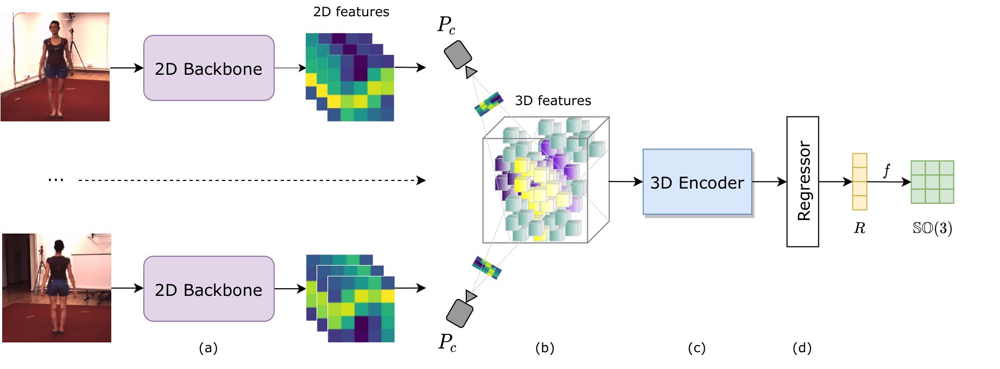

# KinematicNet

## Preparing the data
The dataset is preprocessed. The annotation file and the videos can be downloaded from [here](https://drive.google.com/drive/folders/11FVRcEpXWamfR_ffuboBLSFZltx-9_Um?usp=sharing). Once the data are downloaded, follow some [pre-processing of the videos](preprocessing/README.md) and organize the filesystem like this.

    ${ROOT}
        |--data
        |   |--images/
        |   |--annotations.npy
        |--dataset
        |...

## How to run the code

First, install necessary packages via ``virtualenv`` by running:

    // create the virtual environment
    $ virtualenv venv
    // activate the virtual environment
    $ source venv/bin/activate
    // install required packages
    (venv) $ pip3 install -r requirements.txt

Then, run the training code:

    // for SO(3) supervision
    (venv) $ python3 train_roofing.py --config experiments/roofing/l2/<config>.yaml
    // OR for direct supervision
    (venv) $ python3 train_roofing_direct.py --config experiments/roofing/l2/<config>.yaml

Multi-GPUs can be run by commenting out the line ``model = nn.DataParallel(model)`` in the ``main()`` method.

To evaluate the results, run:

    (venv) $ python3 evaluate_roofing.py --record logs/<path-to-result-file>.pkl