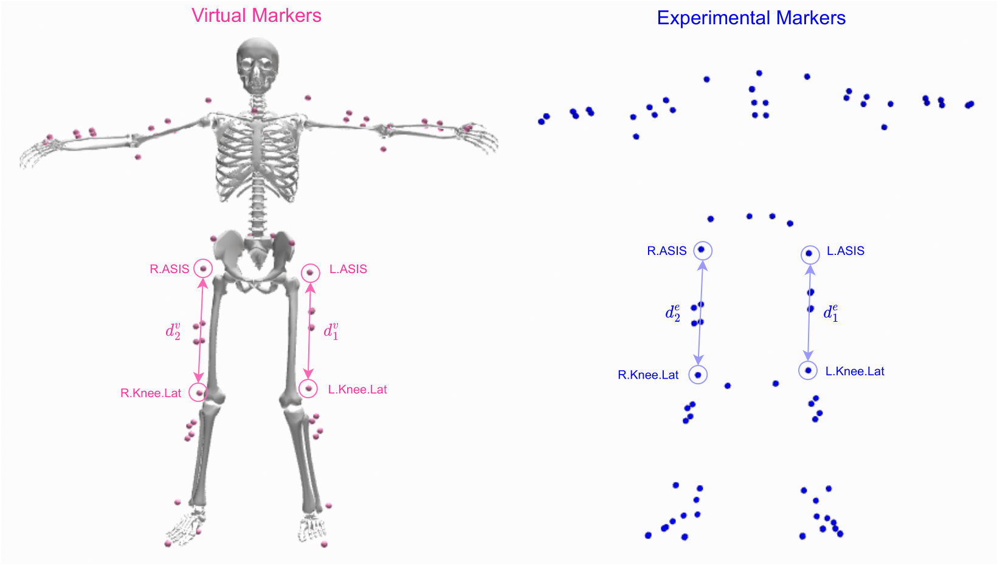

# Preprocessing

The videos and the annotation file can be found [here](https://drive.google.com/drive/folders/11FVRcEpXWamfR_ffuboBLSFZltx-9_Um?usp=sharing). After downloading the ``.tar.gz`` file, extract it using:

    tar -xvf roofing_videos.tar.gz

Extract the videos to images via this [tutorial](https://learnopencv.com/reading-and-writing-videos-using-opencv/) using OpenCV and organize the structure of the filesystem like this:

    images/
        |--S04
        |   |--Act0
        |   |   |--Cam0
        |   |   |   |--<frame-id>.jpg
        |   |   |   |...
        |   |   |--Cam1
        |   |   |--Cam2
        |   |--Act1
        |   |--Act2
        |...

**Note:** Fix the index of the Act and Cam on the videos from {1, 2, 3} to {0, 1, 2} first.

## OpenSim Preprocessing

Of course, the annotation file can be pre-processed better if you want to calculate the joint angles and joint positions (optional) from the marker data files. This section shows the standard biomechanics pipeline that calculates joint kinematics from 3D marker positions. You can download OpenSim 4.2 from the official OpenSim [website](https://opensim.stanford.edu/).

###  TRC Files
The TRC files contain information about the marker positions of the subjects for each trial. It can be found in the ``OpenSim`` subfolder [here](https://drive.google.com/drive/folders/11FVRcEpXWamfR_ffuboBLSFZltx-9_Um?usp=sharing).

### OpenSim Generic Model
The musculoskeletal model we used can be downloaded in the ``OpenSim`` subfolder as ``model.osim``.

### Model Scaling

Model scaling aims to match the virtual bone segments to those of the subjects in the real world. To accomplish this, we first tweak the set of virtual markers, $m^v$, on the OpenSim generic model to best match the experimental ones, $m^e$.  Each body segment is scale using a scaling factor $s_i=d^e_i/d^v_i$, where $d^e_i$ and $d^v_i$ is the experimental subject's and the musculoskeletal model's segment length, respectively. In other words, the scaling factor for each segment is the ratio between the subject's and the OpenSim model's segment length, calculate by the distance between two markers place at both ends of the segment. An example of scaling the femurs is visualize in the figure above. The same process is applied to all major segments, namely torso, left/right femur, left/right tibia, pelvis, left/right humerus, left/right ulna and left/right radius. More info can be found [here](https://simtk-confluence.stanford.edu:8443/display/OpenSim/How+Scaling+Works).

We provide the scaling factors for each subject in ``scale.zip`` in the same OpenSim subfolder [here](https://drive.google.com/drive/folders/11FVRcEpXWamfR_ffuboBLSFZltx-9_Um?usp=sharing). You can create your own scaling factors to better fit the virtual model to the real subject by following this [tutorial](https://www.youtube.com/watch?v=_z0_aWIgosY&ab_channel=SpencerBaker). Use the ``<subject>_standing.trc`` files to scale the model.

### Inverse Kinematics

IK aligns the virtual markers to the experimental VICON markers' trajectories with minimal errors of the distance between the two types of markers. Specifically, the objective function of IK was to minimize the weighted least squared errors between $m^v$ and $m^e$:

$\begin{align}
    \min \Bigg[\sum_{i}^{|m^v|} w_i \lVert m_i^e - m_i^v \rVert^2 \Bigg]
\end{align}$

where $|m^v|$ is the number of markers, $w_i$ is the weight for each marker, and $\lVert \cdot \rVert$ is the Euclidean norm as $m_i$ is the marker's coordinates represented as a vector. The weights are relative to one another, and we put more weights on the markers attached to more articulated joints, i.e., elbows and knees.

These synthetic joint rotations and positions are the ground-truth labels for the deep learning process.

We provide the IK parameters for each trial in ``IK.zip`` in the same OpenSim subfolder [here](https://drive.google.com/drive/folders/11FVRcEpXWamfR_ffuboBLSFZltx-9_Um?usp=sharing). You can learn how to run IK by following this [tutorial](https://www.youtube.com/watch?v=fTK35jkUOIU&ab_channel=SpencerBaker). **Tip:** use more weights for joints that are more articulated; the weights are relative.

### IK Output

You will need to record the ``.mot`` files (for motion) to access to the joint angles calculated for each frame. The 3D keypoints (optional) can be recorded by using the OutputsVec3 Output Reporter from OpenSim. That will result in ``.sto`` files (for storage). We also provide examples in the shared Drive.

Finally, put all ``.mot`` files into the same folder and ``.sto`` files into another folder. Fix the file path in ``generate_labels.py`` and run:

    python3 generate_labels.py

to get the (hopefully more quality) annotation file.